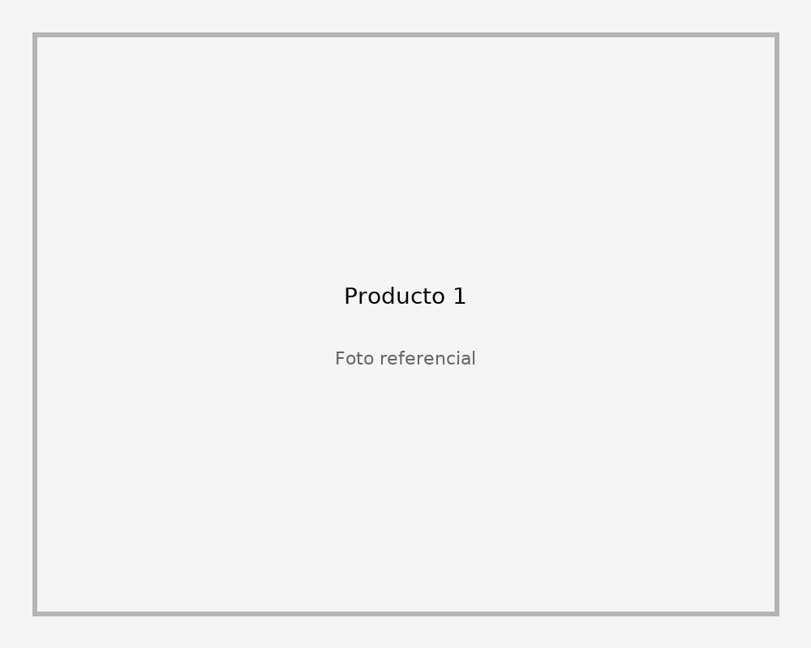

# 🚀 Guía Completa de SEO para Compratica.com

## 📋 Índice
1. [Hacer tu sitio visible en Internet](#1-hacer-tu-sitio-visible-en-internet)
2. [Optimizaciones SEO Técnico](#2-optimizaciones-seo-técnico)
3. [SEO On-Page](#3-seo-on-page)
4. [SEO Off-Page](#4-seo-off-page)
5. [Google Search Console y Analytics](#5-google-search-console-y-analytics)
6. [Estrategias de Contenido](#6-estrategias-de-contenido)
7. [Checklist Final](#7-checklist-final)

---

## 1. Hacer tu sitio visible en Internet

### 🌐 Opciones de Hosting (de más fácil a más avanzado)

#### **Opción A: GitHub Pages (GRATIS)**
✅ Recomendado para empezar
```bash
# 1. Crea un repositorio en GitHub
# 2. Sube tus archivos
git add .
git commit -m "Initial commit"
git push origin main

# 3. Ve a Settings > Pages
# 4. Selecciona branch main
# 5. Tu sitio estará en: https://tuusuario.github.io/compratica/
```

**Ventajas:**
- Gratis
- SSL automático (HTTPS)
- Rápido y confiable
- Dominio personalizado gratis

**Cómo conectar tu dominio compratica.com:**
1. En tu proveedor de dominio, agrega estos registros DNS:
```
Tipo: A
Host: @
Value: 185.199.108.153
       185.199.109.153
       185.199.110.153
       185.199.111.153

Tipo: CNAME
Host: www
Value: tuusuario.github.io
```

#### **Opción B: Netlify (GRATIS)**
✅ Muy fácil, con deploy automático

1. Ve a [netlify.com](https://netlify.com)
2. Arrastra tu carpeta del proyecto
3. Conecta tu dominio en Settings > Domain Management
4. ¡Listo! Deploy automático con cada cambio

**Ventajas:**
- Deploy en segundos
- SSL automático
- CDN global (súper rápido)
- Formularios gratis
- Funciones serverless

#### **Opción C: Vercel (GRATIS)**
Similar a Netlify, ideal para proyectos modernos
```bash
npm i -g vercel
vercel
# Sigue las instrucciones
```

#### **Opción D: Hosting Tradicional Costa Rica**
Para soporte local y control total:
- **ICE Hosting** (~$5/mes)
- **Racsa Cloud** (~$8/mes)
- **HostDime Costa Rica** (~$10/mes)

**Lo que necesitas:**
- Panel cPanel o FTP
- Subir archivos vía FileZilla
- Configurar dominio

---

## 2. Optimizaciones SEO Técnico

### ✅ Ya implementadas:

1. **Meta Tags básicos** ✓
   - Title optimizado
   - Description
   - Keywords
   - Open Graph para redes sociales
   - Twitter Cards

2. **Schema.org Structured Data** ✓
   - Organization Schema
   - WebSite Schema
   - Product Schema con precios
   - JSON-LD implementado

3. **robots.txt** ✓
4. **sitemap.xml** ✓

### 🔧 Optimizaciones Adicionales:

#### **A. Velocidad de Carga**

**Optimiza imágenes:**
```bash
# Usa herramientas como:
- TinyPNG.com (online, gratis)
- ImageOptim (Mac)
- GIMP (gratis, todas las plataformas)

# Tamaños recomendados:
- Logo: máx 100KB
- Productos: máx 200KB cada una
- QR codes: máx 50KB

# Formatos:
- WebP (mejor compresión, moderno)
- JPG para fotos
- PNG para logos/transparencias
```

**Implementa lazy loading** (ya lo hicimos en el código):
```html

```

#### **B. Archivo .htaccess (para hosting Apache)**

Crea un archivo `.htaccess` en la raíz:

```apache
# Habilitar compresión GZIP
<IfModule mod_deflate.c>
  AddOutputFilterByType DEFLATE text/html text/plain text/xml text/css text/javascript application/javascript application/json
</IfModule>

# Cache del navegador
<IfModule mod_expires.c>
  ExpiresActive On
  ExpiresByType image/jpg "access plus 1 year"
  ExpiresByType image/jpeg "access plus 1 year"
  ExpiresByType image/gif "access plus 1 year"
  ExpiresByType image/png "access plus 1 year"
  ExpiresByType image/webp "access plus 1 year"
  ExpiresByType text/css "access plus 1 month"
  ExpiresByType application/javascript "access plus 1 month"
</IfModule>

# Forzar HTTPS
<IfModule mod_rewrite.c>
  RewriteEngine On
  RewriteCond %{HTTPS} off
  RewriteRule ^(.*)$ https://%{HTTP_HOST}%{REQUEST_URI} [L,R=301]
</IfModule>

# Redireccionar www a no-www
RewriteCond %{HTTP_HOST} ^www\.compratica\.com [NC]
RewriteRule ^(.*)$ https://compratica.com/$1 [L,R=301]
```

---

## 3. SEO On-Page

### 📝 Contenido de Calidad

#### **Mejora las descripciones de productos**

En lugar de "Producto 1", usa nombres descriptivos:

```html
<h2>Licuadora Oster 10 Velocidades - Nueva</h2>
<p>Licuadora de alta potencia, ideal para batidos y smoothies.
   Incluye jarra de vidrio de 1.5L. Como nueva, poco uso.</p>
```

#### **Agrega más contenido útil**

Crea estas secciones en index.html:

```html
<section class="info-section">
  <h2>¿Cómo Comprar en Compratica?</h2>
  <ol>
    <li>Encuentra el producto que te gusta</li>
    <li>Escanea el código QR SINPE</li>
    <li>Realiza el pago desde tu banco</li>
    <li>Confirma por WhatsApp</li>
    <li>¡Recibe tu producto!</li>
  </ol>
</section>

<section class="benefits">
  <h2>¿Por qué comprar en Compratica?</h2>
  <ul>
    <li>✅ Pago seguro con SINPE QR</li>
    <li>✅ Sin intermediarios, trato directo</li>
    <li>✅ Productos de calidad verificados</li>
    <li>✅ Entrega rápida en Costa Rica</li>
  </ul>
</section>
```

### 🎯 Palabras Clave (Keywords)

**Principales para Costa Rica:**
- marketplace costa rica
- compra venta costa rica
- venta garaje online
- sinpe qr compras
- tienda online costa rica
- compratica
- productos usados costa rica
- segunda mano costa rica

**Usa estas palabras en:**
- Títulos (H1, H2)
- Primeros 100 caracteres del contenido
- Alt text de imágenes
- URLs (ej: compratica.com/venta-garaje-costa-rica)

---

## 4. SEO Off-Page

### 🔗 Estrategias para conseguir enlaces y tráfico

#### **A. Redes Sociales (GRATIS)**

1. **Facebook:**
   - Crea página de negocio
   - Publica productos diariamente
   - Únete a grupos: "Compra Venta Costa Rica", "Venta Garaje CR"
   - Usa Facebook Marketplace

2. **Instagram:**
   - Perfil de negocio
   - Stories diarias con productos
   - Hashtags: #costarica #ventagaraje #compraveracr #sinpe

3. **TikTok:**
   - Videos cortos mostrando productos
   - "Unboxing" o demos
   - Hashtags virales de CR

#### **B. Directorios y Listados (GRATIS)**

Registra tu sitio en:
- ✅ Google My Business
- ✅ Facebook Business
- ✅ Páginas Amarillas CR
- ✅ Encuentra24.com
- ✅ OLX Costa Rica
- ✅ Mercado Libre

#### **C. Backlinks de Calidad**

**Blog Guest Posting:**
- Escribe artículos en blogs de Costa Rica
- Incluye link a tu sitio
- Temas: "Cómo comprar seguro online", "Guía SINPE QR"

**Colaboraciones:**
- Contacta influencers ticos pequeños
- Ofrece productos gratis a cambio de review
- Pide que enlacen a tu sitio

**Medios Locales:**
- Envía nota de prensa a:
  - CRHoy.com
  - Teletica.com
  - Monumental.co.cr
- Tema: "Nueva plataforma tica revoluciona compra-venta online"

---

## 5. Google Search Console y Analytics

### 📊 Google Search Console (ESENCIAL)

**Paso 1: Verificar propiedad**
```
1. Ve a: https://search.google.com/search-console
2. Agrega propiedad: compratica.com
3. Método: HTML tag (ya tienes el meta tag en index.html)
4. Verifica
```

**Paso 2: Enviar Sitemap**
```
1. En Search Console > Sitemaps
2. Agregar sitemap: https://compratica.com/sitemap.xml
3. Enviar
```

**Paso 3: Monitorear**
- Revisa "Rendimiento" semanalmente
- Mira qué búsquedas traen tráfico
- Revisa errores de indexación
- Pide indexación manual de páginas nuevas

### 📈 Google Analytics 4 (GRATIS)

```html
<!-- Agrega esto en el <head> de index.html -->
<!-- Google tag (gtag.js) -->
<script async src="https://www.googletagmanager.com/gtag/js?id=G-XXXXXXXXXX"></script>
<script>
  window.dataLayer = window.dataLayer || [];
  function gtag(){dataLayer.push(arguments);}
  gtag('js', new Date());
  gtag('config', 'G-XXXXXXXXXX');
</script>
```

**Para conseguir tu ID:**
1. Ve a [analytics.google.com](https://analytics.google.com)
2. Crea cuenta
3. Copia el código de tracking
4. Reemplaza G-XXXXXXXXXX con tu ID real

---

## 6. Estrategias de Contenido

### 📝 Blog (Altamente Recomendado)

Crea una carpeta `/blog/` con artículos:

**Ideas de artículos:**
1. "Cómo usar SINPE QR de forma segura"
2. "Guía completa para vender en línea en Costa Rica"
3. "10 consejos para comprar productos usados"
4. "Venta de garaje online: Guía paso a paso"
5. "Mejores prácticas para fotos de productos"

**Beneficios:**
- Más contenido = mejor posicionamiento
- Atrae tráfico orgánico
- Establece autoridad
- Más palabras clave posicionadas

### 🎥 Contenido Multimedia

1. **Videos YouTube:**
   - Tutoriales de uso
   - Demos de productos
   - Testimonios de clientes

2. **Imágenes optimizadas:**
   - Alt text descriptivo
   - Nombres de archivo descriptivos (ej: licuadora-oster-10-velocidades.jpg)

---

## 7. Checklist Final

### ✅ Checklist de Implementación Inmediata

**Técnico:**
- [x] Meta tags optimizados
- [x] Schema.org implementado
- [x] robots.txt configurado
- [x] sitemap.xml actualizado
- [x] Lazy loading en imágenes
- [ ] Optimizar imágenes (comprimirlas)
- [ ] Configurar Google Analytics
- [ ] Configurar Google Search Console
- [ ] SSL/HTTPS habilitado
- [ ] Comprimir CSS/JS

**Contenido:**
- [ ] Mejorar nombres de productos
- [ ] Agregar descripciones detalladas
- [ ] Agregar sección "¿Cómo comprar?"
- [ ] Agregar sección "Beneficios"
- [ ] Crear blog con 3-5 artículos
- [ ] Agregar fotos de alta calidad

**Promoción:**
- [ ] Crear página Facebook
- [ ] Crear perfil Instagram
- [ ] Publicar en grupos de Facebook
- [ ] Registrar en Google My Business
- [ ] Enviar nota de prensa a medios
- [ ] Contactar 5 influencers locales

**Monitoreo:**
- [ ] Instalar Google Analytics
- [ ] Configurar Search Console
- [ ] Revisar velocidad en PageSpeed Insights
- [ ] Revisar móvil en Mobile-Friendly Test
- [ ] Monitorear posiciones semanalmente

---

## 🎯 Plan de 30 Días para Posicionar en Google

### **Semana 1: Fundación**
- [ ] Subir sitio a hosting (GitHub Pages/Netlify)
- [ ] Configurar dominio compratica.com
- [ ] Instalar SSL (HTTPS)
- [ ] Configurar Google Search Console
- [ ] Enviar sitemap
- [ ] Instalar Google Analytics

### **Semana 2: Optimización**
- [ ] Optimizar todas las imágenes
- [ ] Mejorar descripciones de productos
- [ ] Agregar contenido adicional (secciones informativas)
- [ ] Crear 2 artículos de blog
- [ ] Revisar y mejorar meta descriptions

### **Semana 3: Promoción**
- [ ] Crear perfiles en redes sociales
- [ ] Publicar diariamente en Facebook/Instagram
- [ ] Unirse y publicar en 10 grupos de Facebook
- [ ] Registrar en directorios (Google My Business, etc.)
- [ ] Contactar 5 influencers

### **Semana 4: Expansión**
- [ ] Crear 3 artículos más de blog
- [ ] Conseguir 5 backlinks de calidad
- [ ] Enviar nota de prensa
- [ ] Analizar Google Analytics
- [ ] Ajustar estrategia según datos

---

## 🔥 Tips Avanzados

### **1. Rich Snippets**
Ya implementamos Schema.org, ahora verifica con:
https://search.google.com/test/rich-results

### **2. Velocidad Móvil**
Prueba tu sitio:
https://pagespeed.web.dev/

**Objetivo:** Score > 90

### **3. Core Web Vitals**
Google prioriza:
- **LCP** (Largest Contentful Paint): < 2.5s
- **FID** (First Input Delay): < 100ms
- **CLS** (Cumulative Layout Shift): < 0.1

### **4. Local SEO**
Para aparecer en "cerca de mí":
```html
<script type="application/ld+json">
{
  "@context": "https://schema.org",
  "@type": "LocalBusiness",
  "name": "Compratica",
  "address": {
    "@type": "PostalAddress",
    "addressCountry": "CR",
    "addressRegion": "San José"
  }
}
</script>
```

---

## 📞 Recursos Útiles

### **Herramientas GRATIS:**
- **Google Search Console:** https://search.google.com/search-console
- **Google Analytics:** https://analytics.google.com
- **PageSpeed Insights:** https://pagespeed.web.dev/
- **Rich Results Test:** https://search.google.com/test/rich-results
- **Mobile-Friendly Test:** https://search.google.com/test/mobile-friendly
- **TinyPNG (comprimir imágenes):** https://tinypng.com
- **GTmetrix (velocidad):** https://gtmetrix.com
- **Ubersuggest (keywords):** https://neilpatel.com/ubersuggest/

### **Comunidades Costa Rica:**
- Facebook: "Emprendedores Costa Rica"
- Facebook: "Marketing Digital CR"
- WhatsApp: Grupos de emprendedores locales

---

## 🚀 Próximos Pasos

1. **HOY:**
   - Sube tu sitio a GitHub Pages o Netlify
   - Configura Google Search Console
   - Optimiza las imágenes

2. **ESTA SEMANA:**
   - Crea perfiles en redes sociales
   - Publica en grupos de Facebook
   - Mejora descripciones de productos

3. **ESTE MES:**
   - Escribe 5 artículos de blog
   - Consigue 10 backlinks
   - Registra en directorios

---

## ❓ Preguntas Frecuentes

**Q: ¿Cuánto tarda en aparecer en Google?**
A: 1-4 semanas después de enviar el sitemap. Puede acelerarse con promoción activa.

**Q: ¿Necesito pagar para aparecer primero?**
A: No es obligatorio. El SEO orgánico (gratis) funciona, pero toma tiempo. Google Ads (pago) da resultados inmediatos.

**Q: ¿Cuál es el factor más importante?**
A: Contenido de calidad + backlinks + velocidad del sitio.

**Q: ¿Debo usar Google Ads?**
A: Al inicio sí, ayuda mientras creces orgánicamente. Presupuesto mínimo: $5-10/día.

---

## 🎉 ¡Éxito!

Con esta guía tienes todo lo necesario para hacer que Compratica.com sea visible en Google y aparezca en los primeros resultados.

**Recuerda:** El SEO es un maratón, no un sprint. Los resultados llegan con consistencia y paciencia.

**¿Necesitas ayuda?** Revisa la documentación de Google Search Console o contáctame.

---

**Actualizado:** Marzo 2026
**Versión:** 1.0
